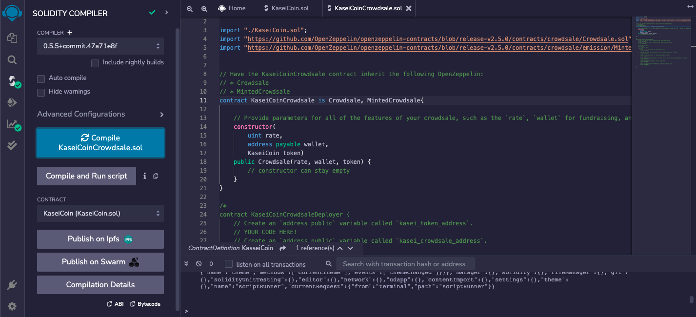

# KaseiCoin_Deployment

The creation of a token called "KasseiCoin" that is funded using a crowdsale.

---

## Technologies

This application is written in Solidity 0.5.5 and is deployed on the [Remix IDE](https://remix.ethereum.org/) using [Metamask](https://metamask.io/) and [Ganache](https://trufflesuite.com/ganache/).

---

## Installation Guide

Prior to running this application, naviagte to the website for Remix IDE where the code is deployed at https://remix.ethereum.org/. Additionally, set up a Metamask and local Ganache wallet.

---

## Usage

In order to launch the application, navigate to the KaseiCoin_Deployment folder that contains all of the code for this application, and then open both the KaseiCoin.sol and KaseiCoinCrowdsale.sol files in the Remix IDE:

Once the files are open in the Remix IDE, navigate to the'compiler' tab and make sure the compiler is set to 0.5.5, and then compile both files. Next, navigate to the 'Deploy and Run Transactions tab' and make sure the contract is set to KaseiCoinCrowdsaleDeployer. From there, enter the name and symbol of the coin and input the wallet address that will be used to receive the crowdsale funds. Click transact to deploy the application. Once deployed, naviagte to the deployed contracts section, and click both contracts in order to copy their respective addresses and proceed to past these addresses one at a time into the At Address box followed by clicking the At Address button to link the addresses to the contracts. Now scroll down to see the various functionalities of the contracts including sending tokens and minting more.

Below, you can see examples of sending transactions of the token and the resulting account balances and total wei raised in the crowdsale being viewed: 

Transaction of 20 wei:

Transaction of 30 wei:

Total Resulting Balance View:

Total Supply View:

Wei Raised Total View:

---

# Evaluation Evidence 

Below is the evidence that all contracts were compiled correctly and deployed:

KaseiCoin Compilation:

KaseiCoinCrowdsale original Compilation:

KaseiCoinCrowdsale final Compilation:

Deployment of KaseiCoin and resulting balance of wallet used:

Linking of the contract addresses:

---

## Contributors

Robby Odum

Email: rodum012@gmail.com

---

## License

MIT

